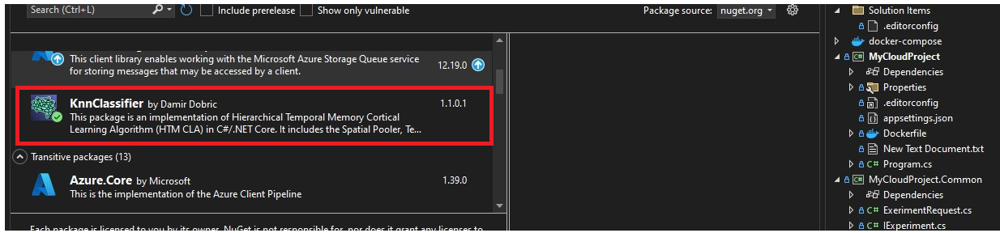

# ML22/23-2	Investigate and Implement KNN Classifier

## Feature overview

*   [x] **Microsoft Azure** 
*   [x] **Docker in Azure**
*   [x] **Azure Storage and Blob Storage**
*   [x] **KNN Classifier integrated with HTM and tested with a large number of sequences**
## Contents

*   [What is this?](#what-is-this)
*   [Prerequisites SE Project](#prerequisites-se-project)
*   [Project Architecture](#project-architecture)
*   [Project Implementation](#project-implementation)
     *   [Create the NuGet Package with Updated NeocortexAPI](#create-the-nuget-package-with-updated-neocortexapi)
     * [Cloud Project](#cloud-project)
        * [Receive the message from Queue](#receive-the-message-from-queue)
        * [Download the dataset from Blob storage](#download-the-dataset-from-blob-storage)
        * [Run the SE experiment](#run-the-se-experiment)
        * [Upload the experiment output to Blob storage](#upload-the-experiment-output-to-blob-storage)
        * [Upload the experiment results to the table](#upload-the-experiment-results-to-the-table)
        * [Delete the message from the Queue](#delete-the-message-from-the-queue)
*  [Azure Deployment](#azure-deployment)
*  [Conclusion](#conclusion)
*  [Sources](#sources)

 ## What is this?
 The SE Project integrates a KNN classifier with the Neocortex API. In the SE project, a sequence of values with preassigned labels was used to train the model.
  Once the model is trained, users can provide an unclassified/test sequence that needs to be labeled.
  For example, in the SE Project, we used two sequences to train the model:

- `("S1", new List<double>(new double[] { 1.0, 2.0, 3.0, 4.0, 5.0, 6.0, 7.0 }))`
- `("S2", new List<double>(new double[] { 10.0, 11.0, 12.0, 13.0, 14.0, 15.0, 16.0 }))`

Now, we will implement this project in a cloud environment, using hundreds of sequences to train and evaluate the model. Some additional conditions need to be fulfilled,
which will be explained further in this README.
 

## Prerequisites SE Project

1. [Documentation](https://github.com/UniversityOfAppliedSciencesFrankfurt/se-cloud-2022-2023/tree/Team_Mariglen_Kejdjon/MySEProject/Documentation)
2. [README](https://github.com/UniversityOfAppliedSciencesFrankfurt/se-cloud-2022-2023/blob/Team_Mariglen_Kejdjon/MySEProject/README.md)
3. [Link to SE Project](https://github.com/UniversityOfAppliedSciencesFrankfurt/se-cloud-2022-2023/tree/Team_Mariglen_Kejdjon/MySEProject/MyProjectSample)

## Project Architecture
Shtoje arkitekturen o joni qela

## Project Implementation

The project implementation was completed in 2 important steps. First, we had to solve a problem with a previous SE project and then implement it in the cloud environment step by step.

### Create the NuGet Package with Updated NeocortexAPI

When we tested our KNN implementation with the cloned Neocortex API, the program ran successfully and everything worked fine. However, when we installed the current version of NeocortexAPI, there was a problem because the [`IClassifierKnn.cs`](https://github.com/ddobric/neocortexapi/blob/master/source/NeoCortexApi/Classifiers/IClassifierKnn.cs) is not implemented in the current `NeoCortexAPI version 1.1.4`, which is the latest version at the time of making this project.
To resolve this, we first cloned the NeocortexAPI repository and added the `IClassifierKnn.cs` file. Then, we created a NuGet package as shown in the image below: 


Next, we installed the NuGet package:



This was the change we made to our SE project. Afterward, we tested our KNN classifier implementation, and everything worked fine. Now, we are ready to deploy it in the Azure Cloud.

### Cloud Project 
Now we can start with the cloud project. First, you have to get the cloud project from [MyCloudProjectSample](https://github.com/UniversityOfAppliedSciencesFrankfurt/se-cloud-2023-2024/tree/main/Source/MyCloudProjectSample). Then we start to modify the project step by step. 
#### Receive the message from Queue

We implemented the method in the `AzureStorageProvider` class to receive a message from the queue.

```csharp
public async Task<IExerimentRequest> ReceiveExperimentRequestAsync(CancellationToken token)
{
    QueueClient queueClient = new QueueClient(this._config.StorageConnectionString, this._config.Queue);

    // Receive a message from the queue
    QueueMessage message = await queueClient.ReceiveMessageAsync();

    if (message != null)
    {
        try
        {
            // Processing of the received message
            string msgTxt = Encoding.UTF8.GetString(message.Body.ToArray());
            ExerimentRequestMessage request = JsonSerializer.Deserialize<ExerimentRequestMessage>(msgTxt);
            request.MessageId = message.MessageId;
            request.MessageReceipt = message.PopReceipt;
            return request;
        }
        catch (JsonException jsonEx)
        {
            logger?.LogError(jsonEx, "JSON deserialization failed for the message");
            Console.Error.WriteLine("The message sent is not correctly formatted. Please send another message.");
        }
    }
    else
    {
        this.logger?.LogInformation("The message is null");
    }

    return null;
}
```
When the following JSON message is given to the Queue:

```bash
{
   "ExperimentId": "1",
   "Name": "KNN Classifier",
   "Description": "A description of choice",
   "InputFile": "New Text Document.txt"
}
```
This method receives it and processes it. The name of the dataset (InputFile) is passed as a parameter to the next method which downloads the dataset from Blob storage. 
Two dataset files can be downloaded. One is the large dataset `LargeDataset.txt` with 100 sequences and the other is `SmallDataset.txt` with only 
one sequence. The small dataset is used to test the functionality of the project.

#### Download the dataset from Blob storage
The next step is to implement the method that downloads the dataset from the blob: 

```csharp
  // Download the dataset from my blob storage
  public async Task<string> DownloadInputAsync(string fileName)
  {
      BlobContainerClient container = new BlobContainerClient(_config.StorageConnectionString, _config.TrainingContainer);
      await container.CreateIfNotExistsAsync();

      // Geting a reference to a blob by its name.
      BlobClient blob = container.GetBlobClient(fileName);

      // Downloading the blob to the specified local file.
      await blob.DownloadToAsync(fileName);

      return fileName;
  }
```
The dataset file is returned and next, we are ready to run the SE experiment.

### Run the SE experiment
To run the SE project we modify the `Experiments`class inside the `MyExperiment` project. We have 
Implemented the method that runs the experiment as follows: 

```csharp
  public Task<IExperimentResult> RunAsync(string inputData)
  {
      // Create output file 
      var outputFile = "output.txt";

      // Read  inputData file
      var text = File.ReadAllText(inputData, Encoding.UTF8);
      var sequences = JsonSerializer.Deserialize<Test>(text);
      

      //  This creates an instance of MultiSequenceLearning and run the method
      MultiSequenceLearning experiment = new MultiSequenceLearning();

      ExperimentResult res = new ExperimentResult(this.config.GroupId, "1");

      res.StartTimeUtc = DateTime.UtcNow;

      // Console output to outpufile
      using (StreamWriter writer = new StreamWriter(outputFile))
      {
          Console.SetOut(writer);
          experiment.Run(sequences.Train);
          writer.Flush();
      }         

      res.Timestamp = DateTime.UtcNow;
      res.EndTimeUtc = DateTime.UtcNow;
      res.ExperimentId = experimentId;
      res.Name = experimentName;
      res.Description = experimentDescription;
      var elapsedTime = res.EndTimeUtc - res.StartTimeUtc;
      res.DurationSec = (long)elapsedTime.GetValueOrDefault().TotalSeconds;
      res.InputFileUrl = inputData;
      res.OutputFileUrl = outputFile;
      res.Accuracy = experiment.accuracy;
      res.OutputFiles = new string[] { outputFile };
      

      return Task.FromResult<IExperimentResult>(res); 
  }
```
This code runs the `MultiSequenceLearning` of the `NeoCortexApi`, which is implemented to use our Knn classifier. The results of the experiment are returned. Some parameters 
are taken from the initial message we send from the Queue message and `Accuracy` is taken from experiment result accuracy. The experiment's output console is saved as `output.txt`
and is given the next method to upload that to the output blob container. 

### Upload the experiment output to Blob storage
Then the method that uploads the experiment output to the Blob storage is implemented: 
```csharp
 public async Task UploadResultAsync(string experimentName, IExperimentResult result)
 {
     string outputFile = result.OutputFiles[0];
     result.OutputFileUrl = experimentName;

     // Initialize the BlobServiceClient and BlobContainerClient
     BlobServiceClient blobServiceClient = new BlobServiceClient(this._config.StorageConnectionString);
     BlobContainerClient containerClient = blobServiceClient.GetBlobContainerClient(this._config.ResultContainer);   

     await containerClient.CreateIfNotExistsAsync();

     BlobClient blobClient = containerClient.GetBlobClient($"{Path.GetFileName(outputFile)}");
  
     await blobClient.UploadAsync(outputFile, overwrite: true);


 }
```

### Upload the experiment results to the table 
The experiment result which was returned is now uploaded to the table storage, by creating a table entity from the result. 
```csharp
 public async Task UploadExperimentResult(IExperimentResult result)
 {
     try
     {
         // New instance of the TableClient class
         TableServiceClient tableServiceClient = new TableServiceClient(this._config.StorageConnectionString);
         TableClient tableClient = tableServiceClient.GetTableClient(tableName: this._config.ResultTable);
         await tableClient.CreateIfNotExistsAsync();

         // Generate a unique RowKey
         string uniqueRowKey = Guid.NewGuid().ToString();

         // Creating a table entity from the result
         var entity = new TableEntity( this._config.ResultTable, uniqueRowKey)
      {
         { "ExperimentId", result.ExperimentId },
         { "Name", result.Name },
         { "Decription", result.Description },
         { "StartTimeUtc", result.StartTimeUtc },
         { "EndTimeUtc", result.EndTimeUtc },
         { "DurationSec", result.DurationSec },
         { "InputFileUrl", result.InputFileUrl },
         { "OutputFileUrl", result.OutputFileUrl },
         { "Accuracy", result.Accuracy },
     };

         // Adding the newly created entity to the Azure Table.
         await tableClient.AddEntityAsync(entity);

     }
     catch (Exception ex)
     {
         Console.Error.WriteLine("Failed to upload to Table Storage: ", ex.ToString());
     }
     
 }
```
Now there is only one method that needs to be implemented and that's to delete the message from the Queue. 

### Delete the message from the Queue 
```csharp
        public async Task CommitRequestAsync(IExerimentRequest request)
        {
            
            var queueClient = new QueueClient(_config.StorageConnectionString, this._config.Queue);
            await queueClient.DeleteMessageAsync(request.MessageId, request.MessageReceipt);
        }
```
Here we take the `MessageId` and the `MessageReceipt` from the message that was sent from the Queue. After completing these methods, we only added logging in to the `Program.cs` tested the program for runtime errors, and improved it. 

## Azure Deployment
Shtoje edhe Azure Deploymen o joni qela. 
# ML22/23-2	Investigate and Implement KNN Classifier

## Feature overview

*   [x] **Microsoft Azure** 
*   [x] **Docker in Azure**
*   [x] **Azure Storage and Blob Storage**
*   [x] **KNN Classifier integrated with HTM and tested with a large number of sequences**
## Contents

*   [What is this?](#what-is-this)
*   [Prerequisites SE Project](#prerequisites-se-project)
*   [Project Architecture](#project-architecture)
*   [Project Implementation](#project-implementation)
     *   [Create the NuGet Package with Updated NeocortexAPI](#create-the-nuget-package-with-updated-neocortexapi)
     * [Cloud Project](#cloud-project)
        * [Receive the message from Queue](#receive-the-message-from-queue)
        * [Download the dataset from Blob storage](#download-the-dataset-from-blob-storage)
        * [Run the SE experiment](#run-the-se-experiment)
        * [Upload the experiment output to Blob storage](#upload-the-experiment-output-to-blob-storage)
        * [Upload the experiment results to the table](#upload-the-experiment-results-to-the-table)
        * [Delete the message from the Queue](#delete-the-message-from-the-queue)
*  [Azure Deployment](#azure-deployment)
*  [Conclusion](#conclusion)
*  [Sources](#sources)

 ## What is this?
 The SE Project integrates a KNN classifier with the Neocortex API. In the SE project, a sequence of values with preassigned labels was used to train the model.
  Once the model is trained, users can provide an unclassified/test sequence that needs to be labeled.
  For example, in the SE Project, we used two sequences to train the model:

- `("S1", new List<double>(new double[] { 1.0, 2.0, 3.0, 4.0, 5.0, 6.0, 7.0 }))`
- `("S2", new List<double>(new double[] { 10.0, 11.0, 12.0, 13.0, 14.0, 15.0, 16.0 }))`

Now, we will implement this project in a cloud environment, using hundreds of sequences to train and evaluate the model. Some additional conditions need to be fulfilled,
which will be explained further in this README.
 

## Prerequisites SE Project

1. [Documentation](https://github.com/UniversityOfAppliedSciencesFrankfurt/se-cloud-2022-2023/tree/Team_Mariglen_Kejdjon/MySEProject/Documentation)
2. [README](https://github.com/UniversityOfAppliedSciencesFrankfurt/se-cloud-2022-2023/blob/Team_Mariglen_Kejdjon/MySEProject/README.md)
3. [Link to SE Project](https://github.com/UniversityOfAppliedSciencesFrankfurt/se-cloud-2022-2023/tree/Team_Mariglen_Kejdjon/MySEProject/MyProjectSample)

## Project Architecture
Shtoje arkitekturen o joni qela

## Project Implementation

The project implementation was completed in 2 important steps. First, we had to solve a problem with a previous SE project and then implement it in the cloud environment step by step.

### Create the NuGet Package with Updated NeocortexAPI

When we tested our KNN implementation with the cloned Neocortex API, the program ran successfully and everything worked fine. However, when we installed the current version of NeocortexAPI, there was a problem because the [`IClassifierKnn.cs`](https://github.com/ddobric/neocortexapi/blob/master/source/NeoCortexApi/Classifiers/IClassifierKnn.cs) is not implemented in the current `NeoCortexAPI version 1.1.4`, which is the latest version at the time of making this project.
To resolve this, we first cloned the NeocortexAPI repository and added the `IClassifierKnn.cs` file. Then, we created a NuGet package as shown in the image below: 


Next, we installed the NuGet package:


This was the change we made to our SE project. Afterward, we tested our KNN classifier implementation, and everything worked fine. Now, we are ready to deploy it in the Azure Cloud.

### Cloud Project 
Now we can start with the cloud project. First, you have to get the cloud project from [MyCloudProjectSample](https://github.com/UniversityOfAppliedSciencesFrankfurt/se-cloud-2023-2024/tree/main/Source/MyCloudProjectSample). Then we start to modify the project step by step. 
#### Receive the message from Queue

We implemented the method in the `AzureStorageProvider` class to receive a message from the queue.

```csharp
public async Task<IExerimentRequest> ReceiveExperimentRequestAsync(CancellationToken token)
{
    QueueClient queueClient = new QueueClient(this._config.StorageConnectionString, this._config.Queue);

    // Receive a message from the queue
    QueueMessage message = await queueClient.ReceiveMessageAsync();

    if (message != null)
    {
        try
        {
            // Processing of the received message
            string msgTxt = Encoding.UTF8.GetString(message.Body.ToArray());
            ExerimentRequestMessage request = JsonSerializer.Deserialize<ExerimentRequestMessage>(msgTxt);
            request.MessageId = message.MessageId;
            request.MessageReceipt = message.PopReceipt;
            return request;
        }
        catch (JsonException jsonEx)
        {
            logger?.LogError(jsonEx, "JSON deserialization failed for the message");
            Console.Error.WriteLine("The message sent is not correctly formatted. Please send another message.");
        }
    }
    else
    {
        this.logger?.LogInformation("The message is null");
    }

    return null;
}
```
When the following JSON message is given to the Queue:

```bash
{
   "ExperimentId": "1",
   "Name": "KNN Classifier",
   "Description": "A description of choice",
   "InputFile": "New Text Document.txt"
}
```
This method receives it and processes it. The name of the dataset (InputFile) is passed as a parameter to the next method which downloads the dataset from Blob storage. 
Two dataset files can be downloaded. One is the large dataset `LargeDataset.txt` with 100 sequences and the other is `SmallDataset.txt` with only 
one sequence. The small dataset is used to test the functionality of the project.

#### Download the dataset from Blob storage
The next step is to implement the method that downloads the dataset from the blob: 

```csharp
  // Download the dataset from my blob storage
  public async Task<string> DownloadInputAsync(string fileName)
  {
      BlobContainerClient container = new BlobContainerClient(_config.StorageConnectionString, _config.TrainingContainer);
      await container.CreateIfNotExistsAsync();

      // Geting a reference to a blob by its name.
      BlobClient blob = container.GetBlobClient(fileName);

      // Downloading the blob to the specified local file.
      await blob.DownloadToAsync(fileName);

      return fileName;
  }
```
The dataset file is returned and next, we are ready to run the SE experiment.

### Run the SE experiment
To run the SE project we modify the `Experiments`class inside the `MyExperiment` project. We have 
Implemented the method that runs the experiment as follows: 

```csharp
  public Task<IExperimentResult> RunAsync(string inputData)
  {
      // Create output file 
      var outputFile = "output.txt";

      // Read  inputData file
      var text = File.ReadAllText(inputData, Encoding.UTF8);
      var sequences = JsonSerializer.Deserialize<Test>(text);
      

      //  This creates an instance of MultiSequenceLearning and run the method
      MultiSequenceLearning experiment = new MultiSequenceLearning();

      ExperimentResult res = new ExperimentResult(this.config.GroupId, "1");

      res.StartTimeUtc = DateTime.UtcNow;

      // Console output to outpufile
      using (StreamWriter writer = new StreamWriter(outputFile))
      {
          Console.SetOut(writer);
          experiment.Run(sequences.Train);
          writer.Flush();
      }         

      res.Timestamp = DateTime.UtcNow;
      res.EndTimeUtc = DateTime.UtcNow;
      res.ExperimentId = experimentId;
      res.Name = experimentName;
      res.Description = experimentDescription;
      var elapsedTime = res.EndTimeUtc - res.StartTimeUtc;
      res.DurationSec = (long)elapsedTime.GetValueOrDefault().TotalSeconds;
      res.InputFileUrl = inputData;
      res.OutputFileUrl = outputFile;
      res.Accuracy = experiment.accuracy;
      res.OutputFiles = new string[] { outputFile };
      

      return Task.FromResult<IExperimentResult>(res); 
  }
```
This code runs the `MultiSequenceLearning` of the `NeoCortexApi`, which is implemented to use our Knn classifier. The results of the experiment are returned. Some parameters 
are taken from the initial message we send from the Queue message and `Accuracy` is taken from experiment result accuracy. The experiment's output console is saved as `output.txt`
and is given the next method to upload that to the output blob container. 

### Upload the experiment output to Blob storage
Then the method that uploads the experiment output to the Blob storage is implemented: 
```csharp
 public async Task UploadResultAsync(string experimentName, IExperimentResult result)
 {
     string outputFile = result.OutputFiles[0];
     result.OutputFileUrl = experimentName;

     // Initialize the BlobServiceClient and BlobContainerClient
     BlobServiceClient blobServiceClient = new BlobServiceClient(this._config.StorageConnectionString);
     BlobContainerClient containerClient = blobServiceClient.GetBlobContainerClient(this._config.ResultContainer);   

     await containerClient.CreateIfNotExistsAsync();

     BlobClient blobClient = containerClient.GetBlobClient($"{Path.GetFileName(outputFile)}");
  
     await blobClient.UploadAsync(outputFile, overwrite: true);


 }
```

### Upload the experiment results to the table 
The experiment result which was returned is now uploaded to the table storage, by creating a table entity from the result. 
```csharp
 public async Task UploadExperimentResult(IExperimentResult result)
 {
     try
     {
         // New instance of the TableClient class
         TableServiceClient tableServiceClient = new TableServiceClient(this._config.StorageConnectionString);
         TableClient tableClient = tableServiceClient.GetTableClient(tableName: this._config.ResultTable);
         await tableClient.CreateIfNotExistsAsync();

         // Generate a unique RowKey
         string uniqueRowKey = Guid.NewGuid().ToString();

         // Creating a table entity from the result
         var entity = new TableEntity( this._config.ResultTable, uniqueRowKey)
      {
         { "ExperimentId", result.ExperimentId },
         { "Name", result.Name },
         { "Decription", result.Description },
         { "StartTimeUtc", result.StartTimeUtc },
         { "EndTimeUtc", result.EndTimeUtc },
         { "DurationSec", result.DurationSec },
         { "InputFileUrl", result.InputFileUrl },
         { "OutputFileUrl", result.OutputFileUrl },
         { "Accuracy", result.Accuracy },
     };

         // Adding the newly created entity to the Azure Table.
         await tableClient.AddEntityAsync(entity);

     }
     catch (Exception ex)
     {
         Console.Error.WriteLine("Failed to upload to Table Storage: ", ex.ToString());
     }
     
 }
```
Now there is only one method that needs to be implemented and that's to delete the message from the Queue. 

### Delete the message from the Queue 
```csharp
        public async Task CommitRequestAsync(IExerimentRequest request)
        {
            
            var queueClient = new QueueClient(_config.StorageConnectionString, this._config.Queue);
            await queueClient.DeleteMessageAsync(request.MessageId, request.MessageReceipt);
        }
```
Here we take the `MessageId` and the `MessageReceipt` from the message that was sent from the Queue. After completing these methods, we only added logging in to the `Program.cs` tested the program for runtime errors, and improved it. 

## Azure Deployment
Shtoje edhe Azure Deploymen o joni qela. 
